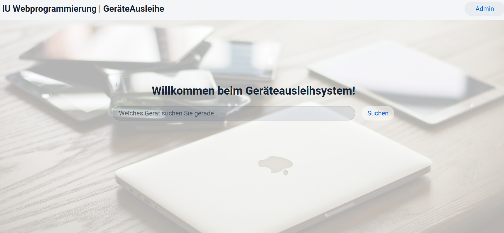
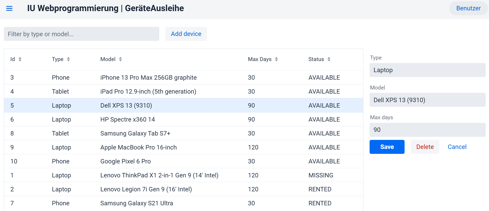
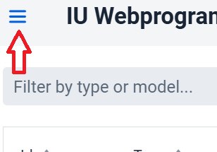
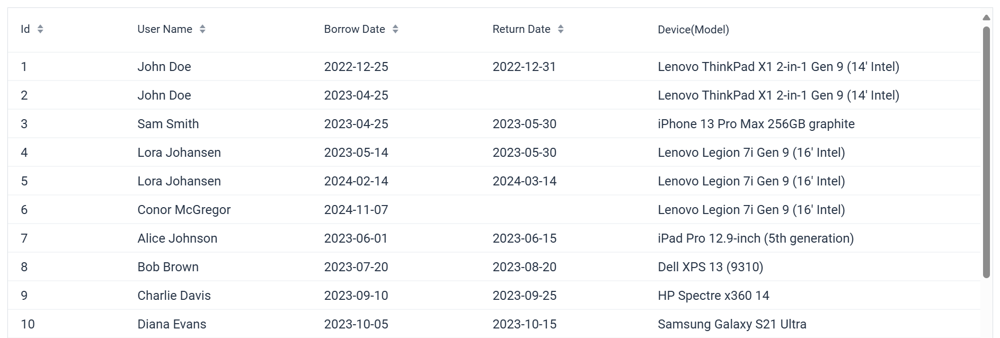
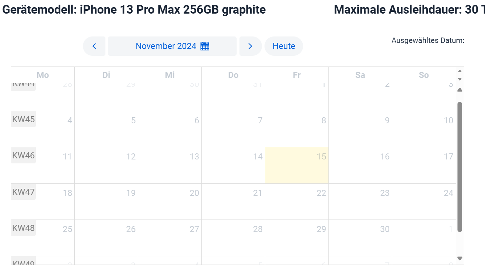
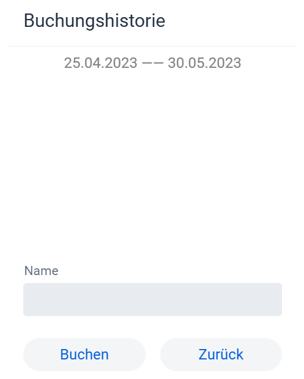

## Vorbereitung

Um den Code auszuführen, benötigen Sie eine PostgreSQL-Datenbank auf Ihrem lokalen Rechner. Sie können diese [hier](https://www.postgresql.org/download/) herunterladen.

### Datenbank erstellen

Erstellen Sie eine Datenbank mit dem Namen `geraeteausleihe`. Sie können dies im SQL-Shell mit dem Befehl `create database geraeteausleihe` tun, sobald Sie eingeloggt sind.

### Datenbankverbindung

Wir verwenden die lokalen Datenbankkontoinformationen des Standardbenutzers `postgres` mit dem Passwort `admin1`. Wenn Sie ein anderes Passwort haben oder einen anderen Benutzer verwenden möchten, können Sie die Informationen in der Datei `/src/main/resources/application.properties` ändern.

# Geräteausleihe Mini-Web-App

## Überblick

Wenn der Benutzer die Seite der Mini-Web-App öffnet, wird er mit der Begrüßung **"Willkommen bei der Geräteausleihe"** und einem passenden Hintergrund empfangen. Unmittelbar darunter befindet sich ein **Suchfeld**, in das der Benutzer eingeben kann, nach welchem Gerät er gerade sucht. In der oberen rechten Ecke ist außerdem eine **Admin-Schaltfläche** vorhanden.

## Geräteverwaltung (Admin)

Unter dem Admin-Punkt wird eine **Geräteliste** angezeigt, die verschiedene Geräte zum Ausleihen auflistet. Jedes Gerät enthält die folgenden Informationen:

- **ID**
- **Gerätetyp**
- **Modell**
- **Maximale Ausleihdauer** (in Tagen)
- **Aktueller Status**

Der **Admin** kann diese Geräte verwalten und neue Geräte hinzufügen. Zusätzlich gibt es eine **Suchfunktion**, die es ermöglicht, die Geräte gezielt zu filtern.

## Navigation

In der linken oberen Ecke kann zwischen zwei Ansichten gewechselt werden:

- **Geräteliste**
- **Buchungsübersicht**

## Buchungsübersicht

Auf der **Buchungsseite** wird angezeigt, wer welches Gerät ausgeliehen hat und wie lange es gebucht ist.

## Geräte suchen und buchen

Wenn der Benutzer nun ein **Gerät sucht**, sieht er alle verfügbaren Geräte sowie deren aktuellen Status. Nachdem ein Gerät ausgewählt wurde, sieht der Benutzer:

- Eine **Kalenderansicht**
- Die **Eigenschaften des Geräts**

Der Benutzer kann auf ein bestimmtes Datum im Kalender klicken, um das gewünschte **Ausleihdatum** festzulegen.

## Gerät buchen

Nachdem der Benutzer ein Datum ausgewählt hat, hat er die Möglichkeit, das Gerät zu buchen, indem er seinen **Namen** angibt. Zusätzlich wird die **Buchungshistorie** des Geräts angezeigt und der Status auf **"vermietet"** gesetzt.

Im Kalender werden die Tage für die **maximale Ausleihdauer** des Gerätes farblich markiert.

Im Kalender wird nach Abgabe des Gerätes die Buchung in der Buchungshistorie vervollständigt und der Status des Gerätes wird auf **"verfügbar"** geändert. Der **Zeitraum** der vollendeten Buchung wird auch im Kalender markiert.

Der Benutzer kann auch auf die **vorherige Ansicht** zurückkehren.
